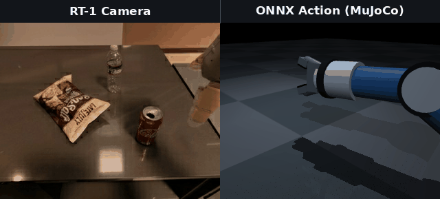
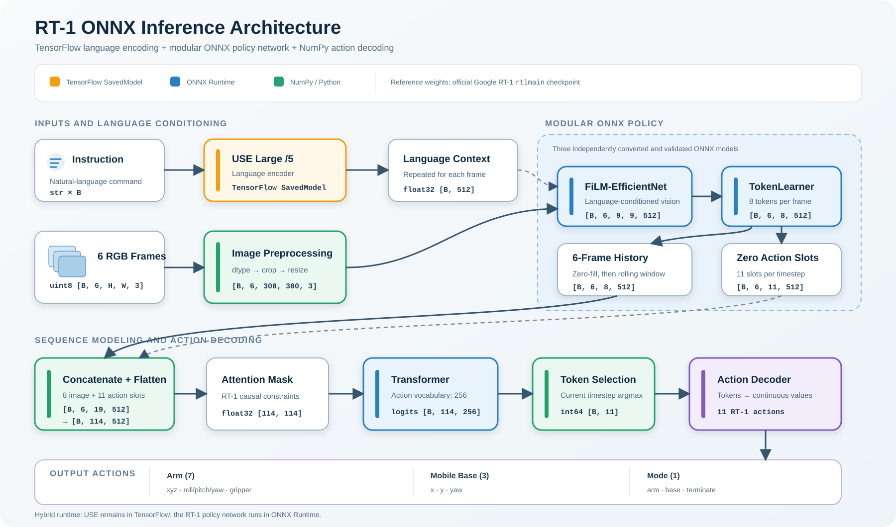

# RT-1 ONNX

> **이 프로젝트는 2026 오픈소스 개발자대회 참가번호 330으로 진행 중인 프로젝트입니다.**

Google의 공식 TensorFlow RT-1을 범용 ONNX 추론 파이프라인으로 전환하고
실제 로봇 episode에서 출력 동등성을 검증하여, 다양한 하드웨어와 실행
환경에서 RT-1을 쉽게 재현하고 확장할 수 있도록 한 오픈소스 프로젝트입니다.

## DEMO

Episode 3의 `move coke can near water bottle` 지시문에 대한 실제 카메라
관측과 ONNX RT-1 action의 MuJoCo 시각화입니다.



## 추론 파이프라인

자연어 지시문과 카메라 관측을 네 개의 ONNX 모델에 연결해 11개의
로봇 action을 출력합니다. 자연어 명령과 카메라 영상이 로봇의 움직임으로
바뀌는 자세한 과정은 [추론 파이프라인 상세 문서](docs/pipeline.md)를
참고하세요.




## 개발 단계

### 1차 완성 범위

현재 저장소에는 다음 기능과 검증 결과가 구현되어 있습니다.

- WSL2 Ubuntu 22.04 기반 공식 TensorFlow RT-1 실행환경 구축
- 공식 `rt1main` 체크포인트를 사용한 모듈식 ONNX 변환
- ONNX USE Large `/5`를 연결한 자연어 instruction 기반 ONNX-only 추론
- NumPy/Python 기반 이미지 전처리, 6프레임 history, Transformer 입력 구성,
  attention mask 및 action 복원
- 공식 TensorFlow와 ONNX의 모듈별 중간 출력 비교
- 실제 Fractal episode 전체에 대한 end-to-end action 동등성 검증
- 사용자가 episode와 자연어 지시문을 지정하는 ONNX 추론 CLI
- episode별 action token과 연속 action JSON 저장
- 카메라 관측과 ONNX action을 비교하는 MuJoCo 기반 시각화
- 변환기, 검증기, 데이터 다운로더 및 시각화 도구 공개

### 2차 개발 계획

다음 항목은 아직 구현하지 않은 2차 개발 계획입니다.

1. RT-1의 end-effector 출력을 사용하여 가상 로봇 팔의 inverse
   kinematics(IK)와 관절값을 계산합니다.
2. RT-1 ONNX의 추론 속도를 높이고 엣지 환경으로 확장하기 위해 OpenVINO를
   적용합니다.

## 핵심 검증 결과

`close middle drawer` 지시문을 포함한 Fractal episode 1의 전체 66프레임을
공식 TensorFlow RT-1과 변환된 ONNX 파이프라인으로 각각 추론했습니다.

```text
비교한 프레임: 66
action token 불일치 프레임: 0
연속 action 불일치: 0
최대 절대 action 오차: 2.38e-07
결과: 일치
```

이 결과는 기록된 실제 RT-1 관측 데이터에 대해 ONNX 정책 네트워크가 공식
TensorFlow 기준 구현과 사실상 동일한 행동을 출력했음을 의미합니다. 실제
로봇에서의 물리적 안전성이나 작업 성공률을 인증하는 결과는 아닙니다.

## 환경 설정

검증 환경, WSL2 구성, Python 가상환경 및 의존성 설치 방법은
[환경 설정 문서](docs/setup.md)를 참고하세요.

## 모델과 데이터 다운로드

USE Large `/5` 모델과 필요한 Fractal episode를 받는 방법은
[다운로드 문서](docs/downloads.md)를 참고하세요.

## ONNX 변환·추론·검증

공식 `rt1main` 체크포인트를 ONNX로 변환하고 자연어 지시문으로 episode를
추론하는 방법은 [ONNX 변환 및 추론 문서](docs/onnx_conversion.md)를,
단계별 출력과 전체 episode의 동등성 검증 결과는
[검증 문서](docs/validation.md)를 참고하세요.

## MuJoCo 시각화

RT-1이 출력한 end-effector action을 MuJoCo에서 도식적으로 시각화하고,
카메라 관측과 나란히 비교할 수 있습니다. 실행 방법과 GIF 생성 과정은
[MuJoCo 시각화 문서](docs/mujoco.md)를 참고하세요.

## 저장소 구조

```text
rt-1-onnx/
|-- assets/                   # README와 문서에서 사용하는 이미지
|-- comparison/               # TensorFlow-ONNX 출력 비교 도구와 검증 안내
|-- data/                     # 다운로드한 Fractal episode (Git 제외)
|-- docs/                     # 설치, 다운로드, 변환, 파이프라인 및 시각화 문서
|   |-- setup.md
|   |-- downloads.md
|   |-- onnx_conversion.md
|   |-- pipeline.md
|   |-- validation.md
|   `-- mujoco.md
|-- models/                   # USE 및 생성된 ONNX 모델 (Git 제외)
|-- official/                 # 공식 TensorFlow RT-1 실행 코드와 검증기
|-- onnx/                     # ONNX 변환기, 추론 파이프라인 및 검증기
|-- scripts/                  # USE 모델과 Fractal episode 다운로드 도구
|-- validation_artifacts/     # 중간 tensor와 검증 JSON (Git 제외)
|-- visualization/            # 카메라 및 MuJoCo 시각화 도구
|-- visualization_artifacts/  # 생성된 GIF (일부 데모를 제외하고 Git 제외)
|-- CONTRIBUTING.md           # 기여 방법
|-- LICENSE.md                # Apache License 2.0
|-- SECURITY.md               # 보안 취약점 제보 정책
|-- THIRD_PARTY_NOTICES.md     # 외부 코드, 모델 및 데이터 고지
`-- requirements.txt          # 검증에 사용한 Python 의존성
```

## 프로젝트 범위와 안전 고지

- 물리적 로봇에서 사용하기 전에는 별도의 안전 제어, workspace 제한,
  충돌 방지, 비상 정지 및 작업별 검증이 필요합니다.
- MuJoCo 결과는 action을 설명하기 위한 도식적 시각화이며 실제 로봇 동작의
  물리 시뮬레이션이 아닙니다.
- 이 저장소는 Google의 공식 제품 또는 공식 ONNX 포팅이 아닙니다.

보안 취약점 제보 방법과 로봇 안전 관련 고지는
[`SECURITY.md`](SECURITY.md)를 참고하세요.

## 관련 자료

- [RT-1 논문 리뷰 및 구조 분석](https://johyeongseob.tistory.com/109) — 프로젝트
  작성자의 논문 해설

## 출처

- [RT-1 논문](https://arxiv.org/abs/2212.06817)
- [google-research/robotics_transformer](https://github.com/google-research/robotics_transformer)
- [google-research/tensor2robot](https://github.com/google-research/tensor2robot)
- [Universal Sentence Encoder Large `/5` 원본](https://tfhub.dev/google/universal-sentence-encoder-large/5)
- [Universal Sentence Encoder Large `/5` ONNX 변환본](https://huggingface.co/SamLowe/universal-sentence-encoder-large-5-onnx)
- [Fractal RT-1 데이터셋](https://www.tensorflow.org/datasets/catalog/fractal20220817_data)
- [ONNX](https://onnx.ai/)
- [tf2onnx](https://github.com/onnx/tensorflow-onnx)
- [ONNX Runtime](https://onnxruntime.ai/)
- [ONNX Runtime Extensions](https://github.com/microsoft/onnxruntime-extensions)
- [MuJoCo](https://mujoco.org/)

## License

이 프로젝트에서 자체적으로 작성한 코드는 Apache License 2.0으로
배포됩니다. 자세한 내용은 [LICENSE.md](LICENSE.md)를 확인하세요.

외부 코드, 모델, 체크포인트 및 데이터셋에는 각각의 원 배포 조건이
적용됩니다. 자세한 출처와 고지사항은
[THIRD_PARTY_NOTICES.md](THIRD_PARTY_NOTICES.md)를 확인하세요.

`official/` 아래의 Google 원본 코드에는 각 디렉터리에 포함된 기존
라이선스와 저작권 고지가 적용됩니다.
